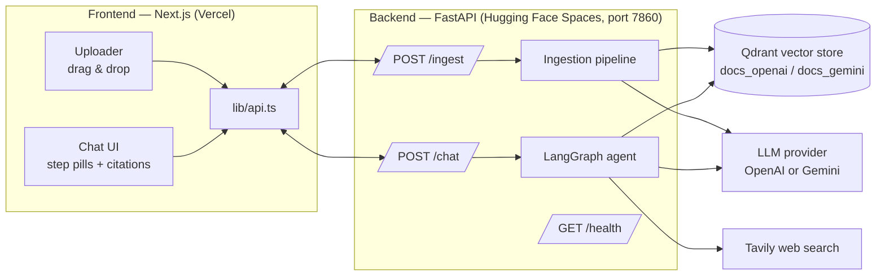
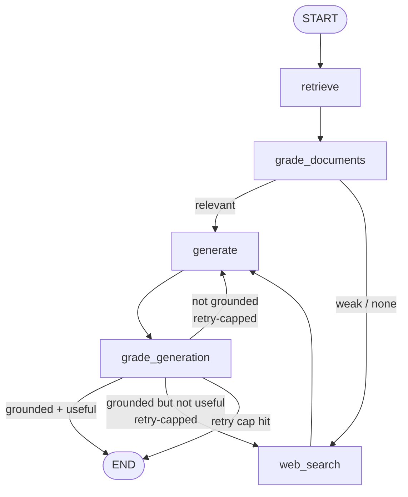
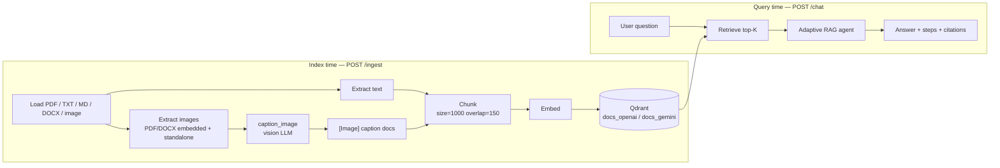

# Adaptive Multimodal Agentic RAG Assistant

A document question-answering system that does **not** just "search and answer."
It *reasons about its own process*: it retrieves candidate passages, judges
whether they are actually relevant, searches the live web when its documents are
not enough, writes an answer grounded strictly in the evidence, and then
**grades its own answer** for two things — is it truthful to the sources, and
does it actually answer the question. If either check fails, it self-corrects in
a loop that is guaranteed to stop.

This README explains the whole project from zero: the ideas behind it, the
architecture, every file, how to run it locally, how the multi-format document
upload works, how to evaluate it, and how to deploy it for free.

---

## Table of contents

1. [What problem does this solve?](#1-what-problem-does-this-solve)
2. [Key concepts (RAG, Agentic RAG, LangGraph)](#2-key-concepts)
3. [High-level architecture](#3-high-level-architecture)
4. [The agent's decision graph, step by step](#4-the-agents-decision-graph-step-by-step)
5. [The ingestion pipeline (how documents get in)](#5-the-ingestion-pipeline)
6. [Repository layout — every file explained](#6-repository-layout--every-file-explained)
7. [Provider auto-detection (OpenAI vs Gemini)](#7-provider-auto-detection)
8. [Prerequisites & API keys](#8-prerequisites--api-keys)
9. [Run the backend locally](#9-run-the-backend-locally)
10. [Run the frontend locally](#10-run-the-frontend-locally)
11. [Using the app: upload → ask](#11-using-the-app-upload--ask)
12. [The API reference](#12-the-api-reference)
13. [Testing](#13-testing)
14. [Evaluation & experiments](#14-evaluation--experiments)
15. [Free-tier deployment runbook](#15-free-tier-deployment-runbook)
16. [Configuration reference](#16-configuration-reference)
17. [Known limitations](#17-known-limitations)
18. [Security](#18-security)
19. [Glossary](#19-glossary)

---

## 1. What problem does this solve?

A plain RAG (Retrieval-Augmented Generation) system works like this: take a
question, find the most similar chunks of text from a document collection, paste
them into a prompt, and ask a language model to answer. This is simple but
fragile:

- **Irrelevant chunks poison the answer.** Vector search always returns *the top
  K* results, even if they are only loosely related. The model then tries to use
  them and drifts off-topic.
- **No graceful fallback.** If the answer simply isn't in your documents, plain
  RAG will still confidently produce something — usually a hallucination.
- **No self-checking.** Plain RAG never asks "is what I just wrote actually
  supported by the sources?" or "did I really answer the question?"

This project fixes those weaknesses by making the system **agentic**: it adds
decision points ("nodes") where a language model grades the intermediate results
and the flow branches accordingly. The result is a system that filters noise,
knows when to look things up on the web, cites its sources, and refuses to answer
(honestly) when it genuinely cannot.

---

## 2. Key concepts

**RAG (Retrieval-Augmented Generation).** Instead of relying only on what a
language model memorized during training, we *retrieve* relevant text from our
own documents and give it to the model as context. This grounds answers in your
data and lets the model cite sources.

**Embeddings & vector store.** To "retrieve relevant text," we convert every
chunk of text into a vector (a list of numbers) using an *embedding model*.
Similar meanings produce nearby vectors. We store these vectors in a **vector
database** (here, **Qdrant**) and, at query time, embed the question and find the
nearest chunk vectors. A crucial rule: the number of dimensions in a vector is
fixed per embedding model, so we keep a **separate Qdrant collection per model**
and never mix them.

**Agentic RAG.** Rather than a straight line (retrieve → answer), the workflow is
a graph with branches and loops driven by an LLM's judgments. The LLM acts as a
*grader* at several points, and those judgments decide where the flow goes next.

**LangGraph.** A library for building exactly this kind of stateful graph. You
define a shared *state* object, a set of *nodes* (functions that read the state
and return updates), and *edges* (including *conditional edges* that pick the
next node based on the state). LangGraph runs the graph until it reaches the
special `END` node. We use it to encode the adaptive control flow described below.

**Structured output.** Whenever an LLM's answer drives control flow (e.g. "is
this chunk relevant: yes/no"), we do **not** parse free text. We bind the model
to a strict schema (`YesNo`) using `with_structured_output`, so the model must
return a clean, machine-readable `yes`/`no`. This makes routing reliable.

**Multimodal ingestion.** Documents often contain diagrams, charts, and
screenshots. We extract those images and ask a vision-capable model to *caption*
them. Each caption becomes its own searchable text document prefixed with
`[Image] …`, so a question answerable only by a figure can still be retrieved and
answered.

---

## 3. High-level architecture



Two independent halves:

- **Backend** (Python): a FastAPI service that ingests documents into Qdrant and
  runs the LangGraph agent to answer questions. Deployable to Hugging Face Spaces
  as a Docker container on port 7860.
- **Frontend** (TypeScript/Next.js): a chat UI with a document uploader. It shows
  the agent's reasoning path as "step pills" and renders clickable citations.
  Deployable to Vercel.

They communicate over HTTP. The frontend points at the backend via a single
environment variable, `NEXT_PUBLIC_API_URL`.

---

## 4. The agent's decision graph, step by step

This is the heart of the project. The control flow is:



The nodes, in order:

1. **`retrieve`** — Embed the question and pull the top-K most similar chunks from
   the provider's Qdrant collection.

2. **`grade_documents`** — For each retrieved chunk, an LLM grader answers "is
   this relevant to the question? yes/no." Irrelevant chunks are dropped. This is
   the noise filter that plain RAG lacks.

3. **Branch after grading:**
   - If relevant chunks survive → go to `generate`.
   - If nothing relevant survives (weak/empty) → go to `web_search` (if enabled
     and the web budget isn't used up); otherwise still go to `generate` so the
     model can honestly say "I don't know."

4. **`web_search`** — Query Tavily, turn each web result into a document (carrying
   its URL and title), and merge those into the working context. This is the
   fallback for questions your documents can't answer.

5. **`generate`** — Write an answer using **only** the surviving context, with
   inline `[1] [2]` citations that map to numbered context blocks. If the context
   is insufficient, the prompt instructs the model to say exactly *"I don't know
   based on the available context."* On regeneration attempts, the temperature is
   nudged up slightly so a stuck, ungrounded answer has a chance to change.

6. **`grade_generation`** — This node makes **two distinct structured judgments**:
   - **Groundedness:** is every claim in the answer supported by the context (no
     hallucination)?
   - **Answer-relevance:** does the answer actually resolve the user's question?

   Then it routes:
   - **Grounded + useful** → `END` (return to user).
   - **Not grounded** → back to `generate` (regenerate from the same context).
   - **Grounded but not useful** → back to `web_search` (gather more evidence).

### Why it always terminates (retry caps)

Loops are dangerous — a badly behaved grader could cycle forever. Two bounded
counters in the state prevent this:

- `regenerate_count` — how many times we've regenerated because the answer wasn't
  grounded. Capped by `MAX_REGENERATIONS` (default 2).
- `web_escalation_count` — how many web searches we've triggered. Capped by
  `MAX_WEB_ESCALATIONS` (default 1).

Every back-edge (the loops) increments one of these bounded counters, so the
total number of steps is bounded. When a cap is hit, the graph goes to `END` and
returns the **best-effort answer flagged `low_confidence = true`**, rather than
looping. A generous `recursion_limit=50` is set as an extra safety net, but the
caps always terminate first.

Each run also records `steps` — the exact ordered list of nodes it visited. The
frontend renders these as pills so the user can *see how* the answer was
produced (e.g. `retrieve → grade docs → web search → generate → grade
generation`).

---

## 5. The ingestion pipeline

Before you can ask questions, you upload documents. Ingestion turns files into
searchable vectors:



**Supported formats and how each is handled:**

| Format | Extension | Handling |
|---|---|---|
| PDF | `.pdf` | PyMuPDF extracts page text **and** embedded images; each image is captioned by the vision model and indexed as an `[Image] …` document. |
| Plain text / Markdown | `.txt`, `.md`, `.markdown` | Loaded as text and chunked directly. |
| Word | `.docx` | Extract paragraph **and table** text, plus any embedded images (from `word/media/` inside the file), which are captioned. |
| Standalone image | `.png`, `.jpg`, `.jpeg`, `.webp` | Captioned directly by the vision model; the caption is indexed as an `[Image] …` document. |

**Chunking.** Long text is split into overlapping windows using
`RecursiveCharacterTextSplitter` (defaults `chunk_size=1000`, `chunk_overlap=150`,
both configurable). Overlap prevents facts from being cut in half at boundaries.

**Idempotency (no duplicates on re-upload).** Every chunk gets a deterministic
point ID derived from a hash of its content (plus source and index). Re-ingesting
the same file upserts in place instead of creating duplicate vectors.

**Structured response.** `POST /ingest` returns
`{filename, file_type, chunks, images_captioned, pages, status}` so the frontend
can render a precise, per-file confirmation regardless of format.

---

## 6. Repository layout — every file explained

```
agentic-rag/
├── README.md                     # This document
├── .gitignore                    # Keeps secrets and build artifacts out of git
├── docs/
│   ├── agent_graph.mermaid       # The decision-graph diagram (source)
│   └── ingestion_pipeline.mermaid# The ingestion diagram (source)
├── backend/
│   ├── Dockerfile                # Builds the HF Space image; listens on 7860
│   ├── .dockerignore
│   ├── .env.example              # Template for secrets (copy to .env)
│   ├── requirements.txt          # Python dependencies
│   ├── pytest.ini                # Test configuration
│   ├── main.py                   # Entrypoint: uvicorn on port 7860
│   ├── README.md                 # HF Space README (frontmatter: sdk docker, port 7860)
│   ├── app/
│   │   ├── __init__.py           # Package + version
│   │   ├── config.py             # Settings + provider auto-detection
│   │   ├── llms.py               # Factories for chat / vision / embedding models
│   │   ├── schemas.py            # Pydantic models: YesNo, GraphState, API contracts
│   │   ├── prompts.py            # All grader & generator prompt text
│   │   ├── vectorstore.py        # Qdrant client + provider-specific collection
│   │   ├── ingestion.py          # Multi-format loaders, captioning, chunk & upsert
│   │   ├── retriever.py          # Top-K retriever over the collection
│   │   ├── tools.py              # Tavily web-search tool
│   │   ├── graders.py            # The three structured LLM graders
│   │   ├── generation.py         # Answer generation + context/source formatting
│   │   ├── graph.py              # The LangGraph state machine (nodes + edges)
│   │   └── api.py                # FastAPI app: /chat, /ingest, /ingest/path, /health
│   ├── tests/
│   │   ├── conftest.py           # Test env + fixtures (no real network/keys)
│   │   ├── test_nodes.py         # Each graph node in isolation (mocked)
│   │   ├── test_routing.py       # The conditional-edge routing functions
│   │   ├── test_graph_integration.py # Full graph: 3 scenarios + retry cap
│   │   └── test_ingestion.py     # Format routing for txt/md/image/docx
│   └── eval/
│       ├── evaluate.py           # Metrics + 4 experiments harness
│       ├── questions.json        # Evaluation Q&A set (incl. out-of-doc questions)
│       └── ERROR_ANALYSIS.md     # 3 traced failures + one fix each
└── frontend/
    ├── package.json              # Next.js deps and scripts
    ├── tsconfig.json
    ├── next.config.js
    ├── next-env.d.ts
    ├── .env.example              # NEXT_PUBLIC_API_URL template
    ├── lib/
    │   └── api.ts                # Typed client: askQuestion + ingestFile helpers
    ├── components/
    │   ├── Uploader.tsx          # Drag-and-drop + button uploader with validation
    │   ├── IngestedList.tsx      # List of indexed docs (icon + chunk count)
    │   ├── StepPills.tsx         # Renders the agent's visited-node path
    │   └── Sources.tsx           # Renders citations (doc vs web, clickable)
    └── app/
        ├── layout.tsx            # Root HTML layout
        ├── globals.css           # All styling
        └── page.tsx              # The chat page; wires everything together
```

### What each backend module does

- **`config.py`** — Loads environment variables and resolves a single, cached
  `Settings` object. It decides the active provider (see §7), the Qdrant
  collection name, chunk sizes, top-K, retry caps, and CORS origins.
- **`llms.py`** — One place that builds the chat model, the vision model, and the
  embedding model for whichever provider is active. Every other module gets its
  models from here, so provider logic never leaks elsewhere.
- **`schemas.py`** — The typed contracts. `YesNo` is the grader schema;
  `GraphState` is the TypedDict threaded through the graph; `ChatRequest/Response`,
  `FileIngestResult`, `IngestResponse`, and `HealthResponse` are the API shapes.
- **`prompts.py`** — Human-readable prompt text for the document grader, the
  groundedness grader, the answer-relevance grader, the generator, and the image
  captioner. Kept separate so wording can be tuned or swept during evaluation.
- **`vectorstore.py`** — Creates/opens the Qdrant client (embedded on-disk by
  default, or a hosted URL) and ensures the provider-specific collection exists
  with the correct vector dimension.
- **`ingestion.py`** — The multi-format pipeline of §5: loaders per format, the
  `caption_image` vision call, chunking, deterministic IDs, and upsert. Returns
  the structured `FileResult`.
- **`retriever.py`** — A thin wrapper that builds a top-K retriever from the
  vector store.
- **`tools.py`** — The `web_search` function (Tavily). Returns web results as
  documents; returns an empty list if Tavily isn't configured or fails.
- **`graders.py`** — Three functions, each calling an LLM bound to `YesNo`:
  `grade_document_relevance`, `grade_groundedness`, `grade_answer_relevance`.
- **`generation.py`** — `generate_answer` (grounded, cited) plus helpers that
  format numbered context blocks and build the `Source` citation objects.
- **`graph.py`** — Defines every node, the conditional edges, the retry-cap logic,
  builds/compiles the LangGraph, and exposes `run_agent(question)`.
- **`api.py`** — The FastAPI application, request validation, CORS, clean error
  handling, and the four endpoints.

### What each frontend file does

- **`lib/api.ts`** — Typed fetch client. `askQuestion` calls `/chat`; `ingestFile`
  uploads to `/ingest`; plus helpers for format validation and building the
  per-type confirmation message.
- **`components/Uploader.tsx`** — The upload control: a click-to-browse button and
  a drag-and-drop zone. It validates file extensions *before* uploading, shows a
  spinner while ingesting, and prints a success or error line per file.
- **`components/IngestedList.tsx`** — Shows what the assistant currently has:
  filename, a file-type icon, and chunk count.
- **`components/StepPills.tsx`** — Renders the `steps` array as numbered pills.
- **`components/Sources.tsx`** — Renders citations, visually distinguishing
  document chunks from web results (web results are clickable links).
- **`app/page.tsx`** — Holds session state (turns + indexed docs), gates the chat
  input until at least one document is indexed, and composes all components.

---

## 7. Provider auto-detection

The system supports two LLM providers and picks one from your environment:

| Env var present | Provider | Embedding model | Vector dim | Qdrant collection |
|---|---|---|---|---|
| `OPENAI_API_KEY` | OpenAI (default here) | `text-embedding-3-small` | 1536 | `docs_openai` |
| `GOOGLE_API_KEY` | Gemini (free-tier) | `text-embedding-004` | 768 | `docs_gemini` |

Rules:

- If only one key is set, that provider is used.
- If **both** are set, `PROVIDER` (`openai`/`gemini`) breaks the tie; the default
  preference is OpenAI.
- If neither is set, the app fails fast with a clear error.

> **Why separate collections?** The embedding vector length differs per model
> (1536 vs 768). A Qdrant collection has a fixed vector size, so each provider
> gets its own collection and they are never mixed. If you switch providers, you
> must re-ingest your documents into the new collection.

---

## 8. Prerequisites & API keys

You need:

- **Python 3.11+** and **Node.js 18+**.
- One LLM key: **`OPENAI_API_KEY`** (default) *or* **`GOOGLE_API_KEY`** (free tier).
- **`TAVILY_API_KEY`** for the web-search fallback (free tier available).

Qdrant needs **no** setup — it runs embedded on disk by default.

Get keys from: OpenAI Platform, Google AI Studio (Gemini), and Tavily. Keep them
out of git — see §18.

---

## 9. Run the backend locally

```bash
cd backend
python -m venv .venv
source .venv/bin/activate            # Windows: .venv\Scripts\activate
pip install -r requirements.txt

cp .env.example .env                 # then edit .env and add your keys
uvicorn app.api:app --host 0.0.0.0 --port 7860
```

Verify it's alive:

```bash
curl http://localhost:7860/health
# {"status":"ok","provider":"openai","collection":"docs_openai",...}
```

Ingest a document and ask a question:

```bash
curl -F "file=@/path/to/paper.pdf" http://localhost:7860/ingest

curl -s -X POST http://localhost:7860/chat \
  -H "Content-Type: application/json" \
  -d '{"question":"What method does the paper propose?"}'
```

---

## 10. Run the frontend locally

```bash
cd frontend
npm install
cp .env.example .env.local           # set NEXT_PUBLIC_API_URL=http://localhost:7860
npm run dev                          # open http://localhost:3000
```

---

## 11. Using the app: upload → ask

1. **Upload.** Drag files onto the upload zone, or click **Upload document**. You
   can select multiple files at once, mixing formats. Unsupported types are
   rejected immediately with a clear message (before any network call).
2. **Watch progress.** A spinner shows "Ingesting {filename}…" while the backend
   processes each file.
3. **Read the confirmation.** Tailored per format, e.g.:
   - PDF/DOCX: *"paper.pdf — 12 pages, 48 chunks, 3 images captioned — indexed
     successfully."*
   - TXT/MD: *"notes.txt — 5 chunks — indexed successfully."*
   - Image: *"diagram.png — image captioned and indexed successfully."*
4. **See what's indexed.** A list shows every indexed document with its type icon
   and chunk count. Uploading more later adds to it without losing earlier ones.
5. **Ask.** The chat box is disabled until at least one document is indexed (with
   the hint *"Upload a document to get started"*). Once you have context, ask
   away. Each answer shows the agent's step pills and its citations.

---

## 12. The API reference

### `GET /health`
Liveness plus provider info. Returns `200` with
`{status, provider, collection, embedding_dim, web_search_enabled, version}`.
Used by the deploy checklist and to warm cold starts.

### `POST /chat`
Body: `{"question": "..."}`. Runs the agent. Returns:

```json
{
  "answer": "…grounded answer with [1] citations…",
  "steps": ["retrieve", "grade_documents", "generate", "grade_generation"],
  "sources": [{"type": "doc", "id": "paper.pdf#1", "title": "paper.pdf (p.3)", "snippet": "…"}],
  "web_search_used": false,
  "low_confidence": false
}
```

### `POST /ingest`
Multipart form-data with a `file` field. Accepts PDF, `.txt`, `.md`, `.docx`, and
`.png/.jpg/.jpeg/.webp`. Returns:

```json
{
  "filename": "paper.pdf",
  "file_type": "pdf",
  "chunks": 48,
  "images_captioned": 3,
  "pages": 12,
  "status": "indexed",
  "collection": "docs_openai",
  "provider": "openai"
}
```

Errors are clean JSON, never stack traces: unsupported format → `400`; corrupt
file or uncaptionable image → `422`.

### `POST /ingest/path`
Body: `{"path": "..."}`. Ingests a server-side file or an entire directory
(useful for batch ingestion during setup). Returns an aggregate summary with a
per-file breakdown.

---

## 13. Testing

The test suite runs with **no API keys and no network** — every LLM/tool boundary
is mocked.

```bash
cd backend
pytest
```

What's covered:

- **`test_nodes.py`** — each node in isolation (retrieve, grade_documents,
  web_search, generate, grade_generation) including the retry-cap decisions.
- **`test_routing.py`** — the conditional-edge functions.
- **`test_graph_integration.py`** — the full compiled graph across the three
  required scenarios: **happy path**, **web-fallback path**, and
  **self-correction path**, plus a test proving the retry cap prevents infinite
  loops.
- **`test_ingestion.py`** — format routing for text, Markdown, standalone images,
  and DOCX, plus rejection of unsupported formats and readable errors for
  uncaptionable images.

---

## 14. Evaluation & experiments

Run after ingesting a corpus (needs real keys, since it calls the live agent and
LLM judges):

```bash
cd backend
python -m eval.evaluate --questions eval/questions.json --out eval/results.json
```

**Metrics reported:**

| Metric | Meaning |
|---|---|
| Retrieval hit rate | % of in-document questions with ≥1 relevant chunk in top-K |
| Groundedness | % of answers fully supported by cited context |
| Answer relevance | % of answers that actually resolve the question |
| Refusal correctness | Out-of-document questions correctly refused or web-answered |
| Latency / cost proxy | Avg seconds and answer length per query |

**Experiments built into the harness:**

1. **Chunk size 500 / 1000 / 2000** → effect on retrieval hit rate (re-ingest per
   value, since it re-embeds).
2. **Top-K 2 / 4 / 8** → precision vs. noise trade-off.
3. **With vs. without document grading** → measure the groundedness/relevance gain
   from the relevance filter.
4. **With vs. without web fallback** → measure coverage gain on out-of-document
   questions.

**Error analysis.** `eval/ERROR_ANALYSIS.md` provides a framework and worked
examples for tracing 3 failures to a specific node (bad retrieval, over-strict
grading, generation ignoring context, or noisy web fallback) with one concrete
fix each. Replace the examples with traces from your own run.

---

## 15. Free-tier deployment runbook

### A. Backend → Hugging Face Spaces (Docker)

1. Create a new **Space** → SDK **Docker** → blank.
2. Push the **contents of `backend/`** to the Space repo root (the `Dockerfile`
   and the `README.md` with `app_port: 7860` frontmatter must be at the root):
   ```bash
   cd backend
   git init && git add . && git commit -m "backend"
   git remote add space https://huggingface.co/spaces/<user>/<space>
   git push space main
   ```
3. In the Space, **Settings → Variables and secrets**, add:
   `OPENAI_API_KEY` (or `GOOGLE_API_KEY`), `TAVILY_API_KEY`, and
   `CORS_ALLOW_ORIGINS` = your Vercel URL.
4. After the build, confirm: `curl https://<user>-<space>.hf.space/health` → `200`.
5. Ingest your corpus against the live Space via `/ingest`.

### B. Frontend → Vercel

1. Import the repo into Vercel; set **Root Directory** = `frontend`.
2. Add env var `NEXT_PUBLIC_API_URL` = your Space URL.
3. Deploy, open the Vercel URL, and run a full upload → ask round-trip against the
   live backend.
4. Set the Space's `CORS_ALLOW_ORIGINS` to the Vercel URL and redeploy the Space.

**Definition of done:** `/health` returns `200` publicly, and the deployed
frontend completes a full chat exchange against the deployed backend.

---

## 16. Configuration reference

All optional unless noted. Set these in `backend/.env` (local) or Space secrets
(deployed).

| Variable | Default | Purpose |
|---|---|---|
| `OPENAI_API_KEY` | — | Use OpenAI (one provider key is required) |
| `GOOGLE_API_KEY` | — | Use Gemini (free tier) |
| `PROVIDER` | auto | Force `openai` or `gemini` when both keys exist |
| `TAVILY_API_KEY` | — | Enables the web-search fallback |
| `QDRANT_URL` | blank | Blank = embedded/local; set to use hosted Qdrant |
| `QDRANT_API_KEY` | — | For hosted Qdrant |
| `QDRANT_PATH` | `./data/qdrant` | On-disk path for embedded Qdrant |
| `CHUNK_SIZE` | `1000` | Characters per chunk |
| `CHUNK_OVERLAP` | `150` | Overlap between chunks |
| `TOP_K` | `4` | Chunks retrieved per query |
| `MAX_REGENERATIONS` | `2` | Cap on self-correction regenerations |
| `MAX_WEB_ESCALATIONS` | `1` | Cap on web-search escalations |
| `CORS_ALLOW_ORIGINS` | `http://localhost:3000` | Comma-separated allowed origins |

Frontend: `NEXT_PUBLIC_API_URL` — the backend base URL (no trailing slash).

---

## 17. Known limitations

These are real free-tier trade-offs, surfaced honestly rather than hidden:

- **Embedded Qdrant is single-writer.** It holds an on-disk lock, so the backend
  runs **one worker**. For scaling, point `QDRANT_URL` at a hosted Qdrant. Don't
  scale Space replicas in embedded mode.
- **Cold starts.** Free Spaces sleep; the first request after idle can take
  20–60s. `/health` warms it.
- **Rate limits.** A single question makes several LLM calls (retrieve → grade N
  chunks → generate → grade ×2), so 5–10+ calls per query. Free tiers may return
  429s under load.
- **Vision captioning cost.** Every image triggers a vision call at ingest time;
  image-heavy PDFs are the main ingest cost. Captioning degrades gracefully to an
  empty caption on failure rather than aborting ingest.
- **Ephemeral storage on Spaces.** The embedded Qdrant lives on the container disk
  and is lost on rebuild — re-ingest after redeploys, or use hosted Qdrant to
  persist.
- **Provider switch = re-ingest.** Different embedding dimensions mean a different
  collection.

---

## 18. Security

- **No secrets in git.** `.env` is git-ignored; only `.env.example` (empty
  placeholders) is committed. Secrets live in Space secrets / Vercel env vars.
- **Clean errors.** The API returns readable JSON error messages, never raw stack
  traces.
- **CORS is explicit.** Only origins listed in `CORS_ALLOW_ORIGINS` may call the
  API from a browser.

---

## 19. Glossary

- **Chunk** — a small window of text (here ~1000 characters) that is embedded and
  stored as one searchable unit.
- **Embedding** — a numeric vector representing text meaning; similar meanings →
  nearby vectors.
- **Vector store / Qdrant** — the database that stores embeddings and finds the
  nearest ones for a query.
- **Top-K** — the number of nearest chunks retrieved per query (default 4).
- **Grader** — an LLM call that returns a structured yes/no used to steer the flow.
- **Groundedness** — whether an answer's claims are supported by the provided
  context (the opposite of hallucination).
- **Node / edge (LangGraph)** — a step in the workflow / the transition between
  steps; conditional edges branch based on the state.
- **Retry cap** — a hard limit on loop iterations that guarantees the agent
  terminates.
- **Low confidence** — a flag set when the agent hits a retry cap and returns a
  best-effort answer instead of looping forever.
